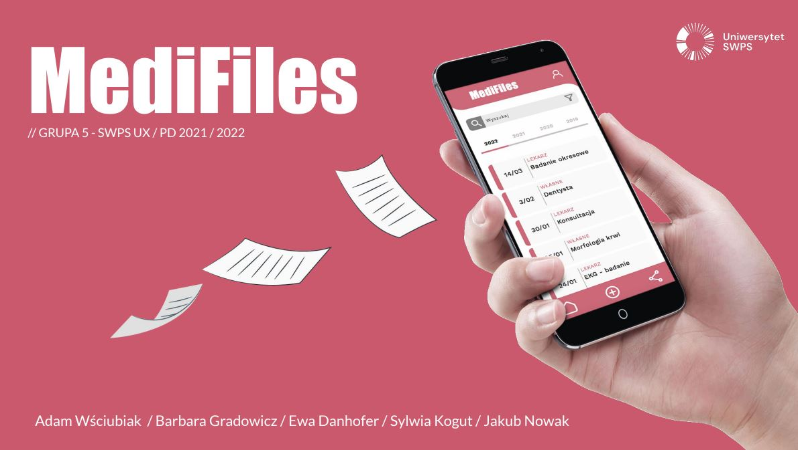
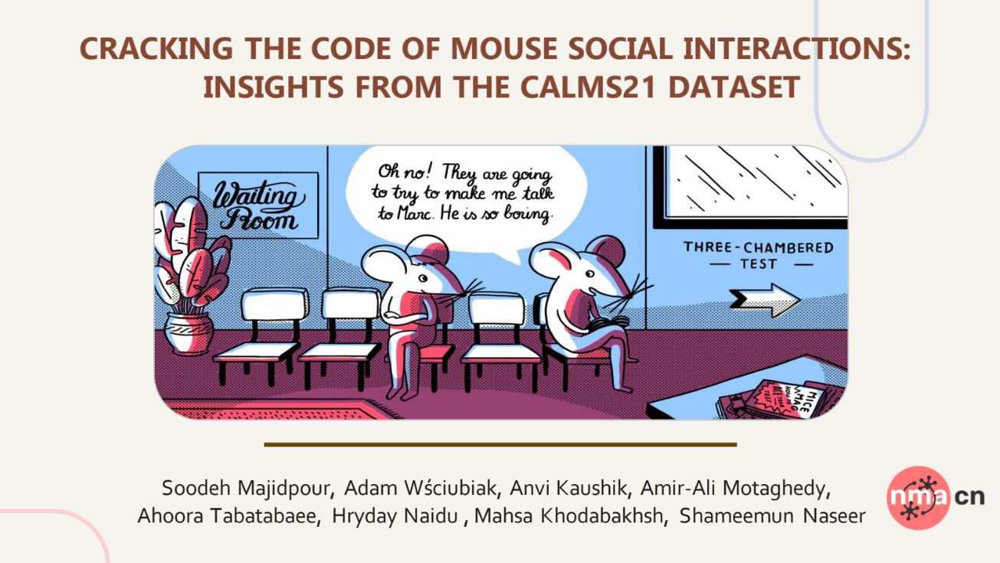
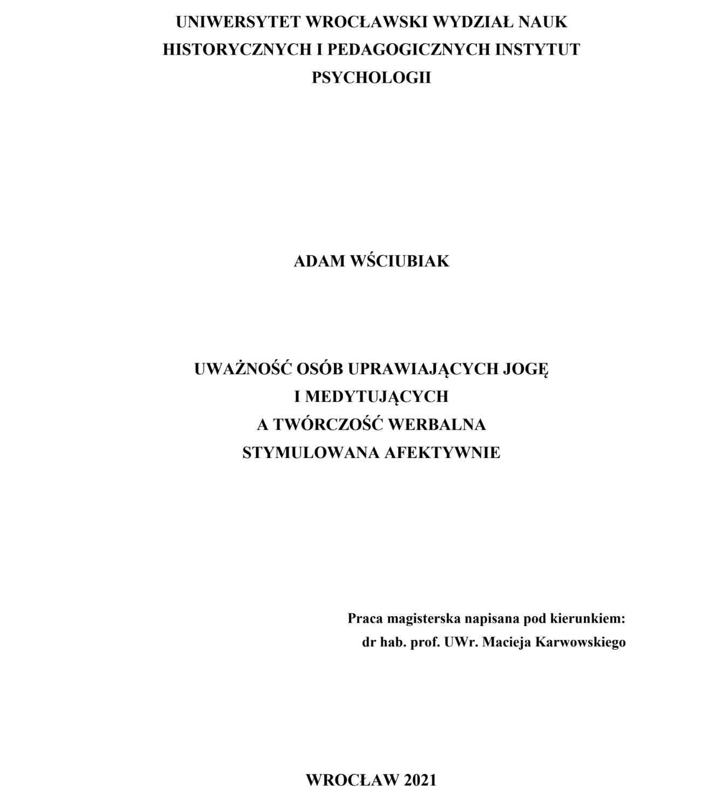

       <!-- About Me Section -->
        <section id="about-me">
            <h2>About Me</h2>
            
I am a psychologist with a strong focus on UX design, cognitive science, and artificial intelligence.
            I hold a Master's degree in Psychology from the University of Wrocław and a postgraduate degree in UX & Product Design from SWPS University.
            My professional experience spans psychological diagnostics, emotion regulation, and neuropsychological therapy. Currently,
            my research focuses on using AI-driven cognitive-behavioral interventions to enhance emotion regulation in adult learners.
            I am passionate about the intersection of AI and mental health, and I aim to pursue a PhD in this field.

        </section>

        <!-- Skills and Experience Section -->
        <section id="skills-experience">
            <h2>Skills & Experience</h2>
            <!-- Skills and Experience content -->
            

                <!-- Skills column -->
                

                    <h3>Skills</h3>
                    <h4>Soft Skills</h4>
                    
In-depth interviewing, psychological diagnostics and psychometry, working with diverse age groups, and training and educating.

                    <h4>Digital Skills</h4>
                    
Proficient in Python, Julia, machine learning, prompt engineering, multi-agent LLMs, and UX/UI research.

                

                <!-- Experience column -->
                

                    <h3>Experience</h3>
                    <h4>Academic Roles</h4>
                    
Founded the Neuropsychology Student Club "Cerebro" at the University of Wrocław, and participated in events such as Neuromatch Academy and Brainhack Krakow.

                    <h4>Industry Experience</h4>
                    
Led a UX team developing a medical documentation app that was recognized for innovation.
                    Worked as a psychologist focusing on emotional and social skill development, and neuropsychological therapy.

                

            

        </section>

        <!-- Projects Section -->
        <section id="projects">
            <h2>Projects</h2>

            <!-- Project 1 -->
            

                <!-- Project content -->
                

                    <!-- Project image -->
                    

                        
                    

                    <!-- Project description -->
                    

                        <h3>Affective Intelligent Agent Model for Personalized Cognitive-Behavioral Interventions</h3>
                        <h4><i>Enhancing Emotion Regulation in Adult Learners</i></h4>
                        
My ongoing research involves developing an Affective Intelligent Agent Model designed to provide personalized cognitive-behavioral interventions. Recognizing that many individuals lack access to professional mental health support due to cost and availability, this AI-driven model aims to enhance emotion regulation among adult learners by dynamically adapting to users' emotional states and personality traits.
                            
                            The model utilizes advanced natural language processing techniques and reinforcement learning strategies to offer safe, theory-based interventions. By integrating emotion recognition and personalized action planning, it seeks to provide scalable and accessible mental health support tailored to individual needs.

                    

                

                <!-- Divider line with button -->
                

                    

                    <button class="toggle-button">Read More</button>
                

                <!-- Hidden detailed content -->
                

                    <!-- Placeholder for additional text and images -->
                    <h4>Project Overview</h4>

                    
 In this project, I am developing an Affective Intelligent Agent Model designed to enhance emotion regulation in adult learners through personalized cognitive-behavioral interventions. Recognizing that stress significantly impacts mental health and academic success, especially among students who often lack access to professional support due to cost and availability, this research leverages advancements in artificial intelligence to provide scalable and accessible mental health solutions.
                        
                    <h4>Background and Motivation</h4>
                        
                        Emotion regulation is a critical component of mental well-being, defined as the goal-oriented process of modifying one's affect to maximize adaptability to the current situation (Gross, 1999). Individuals often intuitively select emotion regulation strategies based on personality traits but may choose maladaptive methods leading to negative outcomes (Zhu et al., 2023). There is a pressing need for tools that assist individuals in selecting effective, adaptive strategies.
                        
                    <h4>The Affective Intelligent Agent Model</h4>
                        
                        The proposed model builds upon recent advancements in AI, particularly Large Language Models (LLMs), to create an agent capable of recognizing a user's emotional state and providing personalized interventions. The model consists of three key components:
                        
                        <b>Emotion Recognition</b>: Utilizing natural language processing, the agent analyzes user input to estimate valence and arousal levels, providing a quantitative measure of emotional states without invasive data collection.
                        
                        Dynamic Planning and Personalization: The agent employs a dynamic planner that considers the user's personality traits and emotional state to select appropriate emotion regulation strategies. By integrating the Beliefs-Desires-Intentions (BDI) framework (Rao & Georgeff, 1995), the model reasons about the best actions to achieve the desired emotional equilibrium.
                        
                        Intervention Execution: The agent delivers personalized cognitive-behavioral interventions based on established psychological theories, such as Gross's model of emotion regulation (Gross, 1999), and adapts over time through reinforcement learning strategies like Q-learning (Watkins & Dayan, 1992). This allows the agent to learn from each interaction, refining its approach to better suit individual users.
                        
                    <h4>Research Objectives</h4>
                        
                        The primary objective is to evaluate the effectiveness of the Affective Intelligent Agent Model in enhancing emotion regulation among adult learners. Specifically, the research aims to:
                        
                        Demonstrate that personalized interventions mediated by the agent provide more effective emotion regulation support compared to non-personalized AI-based interventions.
                        Ensure the model delivers safe, theory-based, and appropriately matched interventions, validated by professional psychologists and computational methods.
                        Methodology
                        
                    </h4>Model Development and Evaluation: The model will undergo rigorous testing, including automatic benchmarking against existing models and manual validation by professional psychologists to ensure safety, accuracy, and appropriateness.
                        
                        Experimental Study: Approximately 60 adult learners will participate in a double-blind study. Participants will be randomly assigned to either the experimental group (receiving personalized interventions) or the control group (receiving non-personalized interventions). Over two weeks to a month, participants will interact with the agent daily.
                        
                    <h4>Data Collection<h4>:
                        
                        Pre-test: Assessments include the Big Five Inventory (BFI) for personality traits and the Difficulties in Emotion Regulation Scale (DERS).
                        Intervention Phase: Immediate affect changes and valence-arousal variances will be measured before and after each intervention.
                        Post-test: Re-assessment with DERS and semi-structured interviews to gauge user satisfaction and perceived effectiveness.
                        Data Analysis: Statistical methods will evaluate the effectiveness of interventions, and qualitative data from interviews will provide insights into user experiences. AI tools like QualiGPT may assist in automating qualitative analysis.
                        
                        Anticipated Impact
                        
                        This project aims to contribute to the field of affective computing and mental health by developing a tool that makes cognitive-behavioral interventions more accessible and personalized. By minimizing costs and ensuring privacy, the model seeks to overcome barriers that prevent many individuals from accessing professional support.
                        
                        Challenges and Mitigation
                        
                        Participant Retention: Strategies include regular communication and incentives to maintain engagement throughout the study.
                        Data Privacy: Participants will be informed about data handling procedures, and anonymization tools will protect sensitive information.
                        Safety Concerns: The model will be thoroughly validated by professionals to prevent the delivery of harmful advice, and participants can report any issues immediately.
                        Future Directions
                        
                        Upon successful completion, the findings could pave the way for scalable AI-driven mental health tools that adapt to individual needs. The model has the potential to be extended beyond educational settings, offering support in various contexts where emotion regulation is crucial.
                        
                        Conclusion
                        
                        Through this research, I aim to bridge the gap between AI advancements and practical mental health support. The Affective Intelligent Agent Model represents a significant step toward providing accessible, personalized interventions, leveraging technology to address a critical need in our society.

                    
                

            

            <!-- Project 2 (Image on the left) -->
            

                <!-- Project content -->
                

                    <!-- Project image -->
                    

                        
                    

                    <!-- Project description -->
                    

                        <h3>Classifying Social Behaviors in Mice Using Machine Learning</h3>
                        <h4><i>Computational Neuroscience Summer School Project</i></h4>
                        
During a month-long computational neuroscience summer school, my team and I worked with datasets of video recordings capturing mice's social interactions. We compared the performance of various classical machine learning algorithms in categorizing these behaviors within a multi-agent framework. This project deepened my understanding of computational neuroscience and reinforced my interest in AI applications for behavioral analysis.

                    

                

                <!-- Divider line with button -->
                

                    

                    <button class="toggle-button">Read More</button>
                

                <!-- Hidden detailed content -->
                

                    <!-- Placeholder for additional text and images -->
                    
[Detailed project description goes here.]

                    
                

            

            <!-- Project 3 -->
            

                <!-- Project content -->
                

                    <!-- Project image -->
                    

                        

                    

                    <!-- Project description -->
                    

                        <h3>Mindfulness and Creativity in Yoga Practitioners</h3>
                        <h4><i>Exploring the Relationship Between Mindfulness and Verbal Creativity</i></h4>
                        
For my Master's thesis, I investigated the relationship between mindfulness and creativity among yoga practitioners and meditators. Using a mixed methods approach, I combined Linguistic Inquiry and Word Count (LIWC) analysis with expert evaluations to assess participants' emotional expressions and verbal creativity. This research provided insights into how mindfulness practices can influence creative processes and contributed to the early application of natural language processing in psychological studies.

                    

                

                <!-- Divider line with button -->
                

                    

                    <button class="toggle-button">Read More</button>
                

                <!-- Hidden detailed content -->
                

                    <!-- Placeholder for additional text and images -->
                    
[Detailed project description goes here.]

                    
                

            

        </section>

